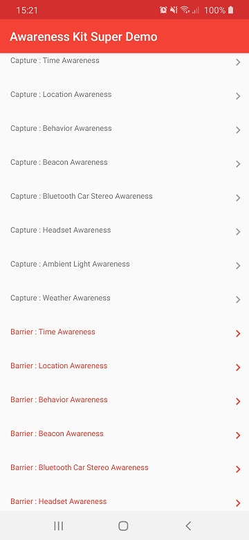

HUAWEI Awareness Kit Demo
=====

HUAWEI Awareness Kit provides your app with the ability to obtain contextual information including users' current time, location, behavior, audio device status, ambient light, weather, and nearby beacons. 
Your app can gain insight into a user's current situation more efficiently, making it possible to deliver a smarter, more considerate user experience.

#What you can try out
---------------------

    

Capture API
------------

- Obtains the current local time or time of a specified location, such as working day, weekend, holiday, morning, afternoon, evening, or late night.
- Obtains the latitude and longitude of the current location.
- Obtains user behavior, such as walking, running, cycling, driving, or staying still.
- Indicates whether the device has approached, connected to, or disconnected from a registered beacon.
- Obtains the status of an audio device (connected or disconnected).
- Obtains the illuminable of the environment where the device is located. The unit is lux.
- Queries the weather information of the device location or a specified location. 

Barrier API
---------

- Sets a timer or a barrier based on the target time. For example, one hour before and after the sunrise can be set as a sunrise barrier.
- Sets a location barrier based on the target location, radius (not smaller than 200 m), and stay duration.
- Detects the behavior change, such as going from staying still to running.
- Sets a beacon barrier based on the beacon status.
- Detects the audio device status change, for example, from plugged in to unplugged.
- Sets the ambient light barrier. 
- The weather awareness does not support the barrier function.

Requirements
------------

 - [Android SDK](http://developer.android.com/sdk/index.html).
 - Android [7.0 (API 24) ](http://developer.android.com/tools/revisions/platforms.html#7.0).
 - Android SDK Tools
 - Android SDK Build tools 29.0.3
 - Android Support Repository
 - Android Support libraries
 - HMS Awareness Kit Library
 - HMS Location Kit Library
 - HMS AG Connect Library

Reference
------------

 - [Huawei Awareness Kit](https://developer.huawei.com/consumer/en/doc/development/HMS-Guides/awareness-introduction)
 
 Preparations
 ------------
 
  - Registering as a Developer to [HUAWEI Developer](https://developer.huawei.com/consumer/en)
  - Import this project with Android Studio and change package name
  - Create an app by referring to [Creating a Project](https://developer.huawei.com/consumer/en/doc/development/AppGallery-connect-Guides/agc-get-started#createproject) and [Creating an App in the Project](https://developer.huawei.com/consumer/en/doc/development/AppGallery-connect-Guides/agc-get-started#createapp)
  - Set the data storage location
  - Enabling Required Services like Awareness Kit
  - Generating a Signing Certificate Fingerprint
  - Configuring the Signing Certificate Fingerprint
  - Get your agconnect-services.json file to the app root directory

Building
--------

To build, install and run a debug version, run this from the root of the project:

    ./gradlew app:assembleDebug